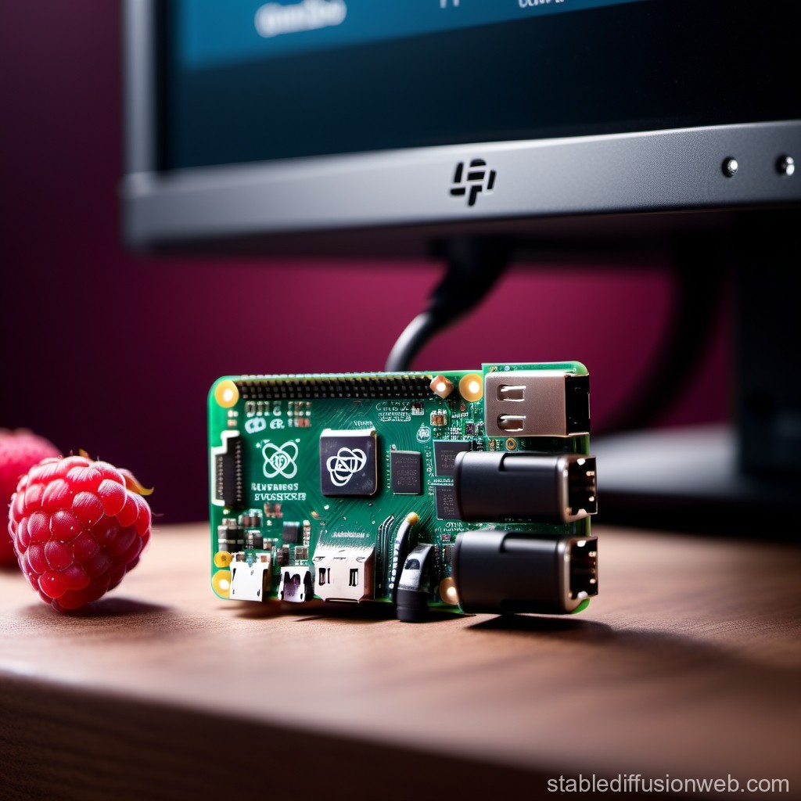

# Raspberry-Pi-Pygame-Kiosk



This is a quick tutorial on how to set up your Raspberry Pi running Raspberry Pi OS (64-bit) 
as a Kiosk using Pygame in fullscreen-mode.


## Why the tutorial?

The Raspberry Pi being a likely first point of contact with the Linux operating 
system for many, for those who want to use it as a kiosk, many of the simpler 
solutions out there do not, not reliably or not work as intended, to spare them 
the journey, that gladly was a couple of days shorter for me than one of my 
references, I decided, to make it available to the public. Especially given I 
was already writing a reference for future me in the first place.

## What is covered in this tutorial?

Following this tutorial will enable you to add the LXTerminal to the autostart 
of your user and utilize a shell script, called by ".bashrc", that if you start 
your Raspberry in desktop-mode navigates to the Desktop and executes a file called 
“test.py”. The files that are being used in this tutorial are contained in the 
repository in a folder called "files".

## Prerequesites (tested with the following setup)
 - Raspberry Pi 5
 - Raspberry Pi OS (64-bit)
 

## How to.

### 1. Adding LXTerminal to your autostart
Out of all the possible ways to do this, I personally prefer to add a shortcut 
to my users autostart folder, as this way configurations can be quickly exchanged 
between different Raspberrys, without the risk of breaking the OS or at least 
complicating things, in a moment of absent minded typing. (Trust me, I know.)

1. Create a shortcut_name.desktop file on your Desktop.
2. Add the following contents to the empty file:
```
[Desktop Entry]
Name=LXTerminal
Comment=Shortcut for opening the LXTerminal
Icon=/usr/share/pixmaps/openbox.png
Exec=/usr/bin/lxterminal
Type=Application
Encoding=UTF-8
Terminal=false
Categories=None;
```
3. Copy the file into your users (pi) autostart directory, if it doesn't exist, create it.
```
/home/pi/.config/autostart
```

### 2. Modify .bashrc to run launcher.sh located on your users Desktop
1. Open the .bashrc file, by typing the following into your terminal:
```
sudo nano /home/pi/.bashrc
```
2. At the bottom of the file, add the following line:
```
sh /home/pi/Desktop/launcher.sh
```

### 3. Create the launcher.sh shell script to run your test.py
1. Create a launcher.sh on your Desktop.
2. Add the following content to it:
```
if [-z "$DESKTOP_SESSION"]; then
	echo "not in the desktop"
	exit 1
else
	cd /home/pi/Desktop && sudo python test.py
fi
```

### 4. Modify your pygame files display mode for kiosk use
1. Set Pygame to use fullscreen, by adding the fullscreen-flag:
```
screen = pygame.display.set_mode((800, 480), flags=pygame.FULLSCREEN)
```
2. If you're using a touchscreen or arcade setup, disable the curser:
```
pygame.mouse.set_visible(False)
```

## References
[Reddit: Jimg911:"Question about running python and pygame from boot"](https://www.reddit.com/r/raspberry_pi/comments/7wj6vp/question_about_running_python_and_pygame_from_boot/)
[RaspberryPiStackexchange: Dcdanny:"start a lxterminal on startup"](https://raspberrypi.stackexchange.com/questions/12730/start-a-lxterminal-on-startup)
[RaspberryProjects.com: "Desktop Shortcuts"](https://raspberry-projects.com/pi/pi-operating-systems/raspbian/gui/desktop-shortcuts)

